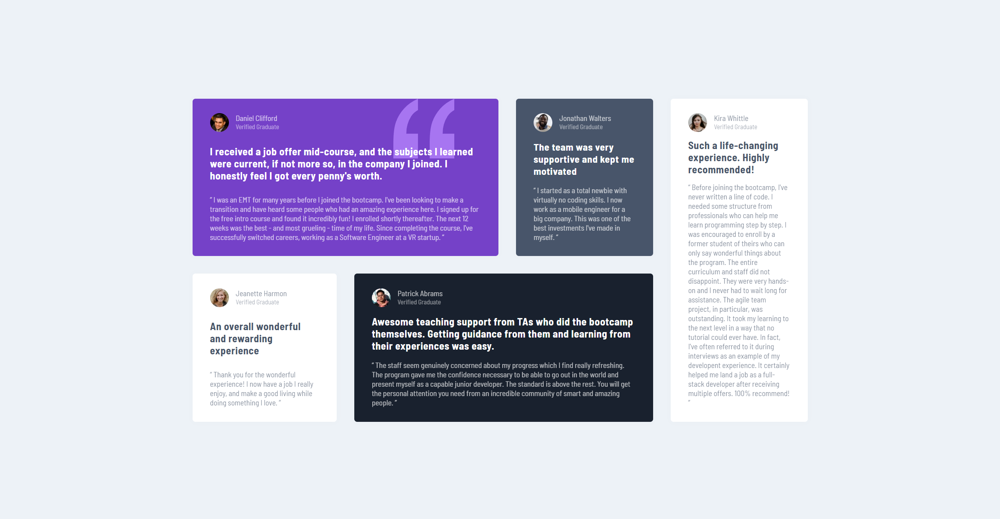

## Table of contents

- [Overview](#overview)
  - [Screenshot](#screenshot)
  - [Links](#links)
- [My process](#my-process)
  - [Built with](#built-with)
  - [Continued development](#continued-development)
  - [Useful resources](#useful-resources)
- [Author](#author)

## Overview

### The challenge

The most challenging part was adjusting the grid. I know that there may be many other ways of doing it. But I was so deep dived into making this thing by grid that's why I feel very happy now. Still there are some things that I think could be perfected. But I am so tired of it so gg.

### Screenshot

Here is a screenshot of the testimonials grid selection replicated by me.

### Links

- Live Site URL: (https://master-shadman7.github.io/testimonials-grid/)

## My process

### Built with

- Semantic HTML5 markup
- CSS custom properties
- Flexbox
- CSS Grid

### Continued development

I want to upgrade my skills in using grid and media queries properties.

### Useful resources

- [W3 School](https://www.w3schools.com/) - This helped me in using media queries, display & box-shadow properties. The try option is just a wow!

## Author

- Website - [Shadman Sadiq](https://www.your-site.com)
- Frontend Mentor - [@Master-Shadman7](https://www.frontendmentor.io/profile/Master-Shadman7)
- Twitter - [@Master_Shadman](https://twitter.com/Master_Shadman)
